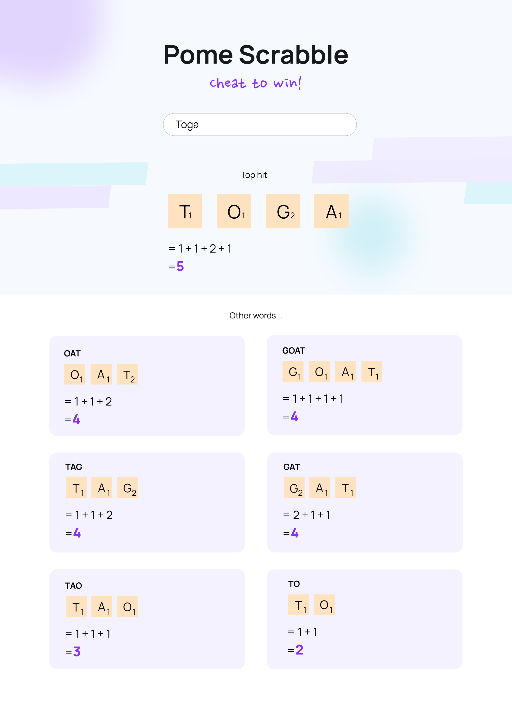

## Setup

1. Fork code to your personal REPO

2. Clone that REPO to your local machine:

3. Get the code running locally

## Tasks

- Complete any/all TODOS throughout the codebase
- Style the frontend to match this [figma design](https://www.figma.com/file/d41HS9VzQyknk91q285EPs/Pome-Scrabble-dev-test?node-id=0%3A1). Use any styling method you like (UI libraries, css or css preprocessors).
  

## Submitting

- Create PR in your forked personal REPO
- Don't create a PR to this REPO
- Send us the REPO URL
